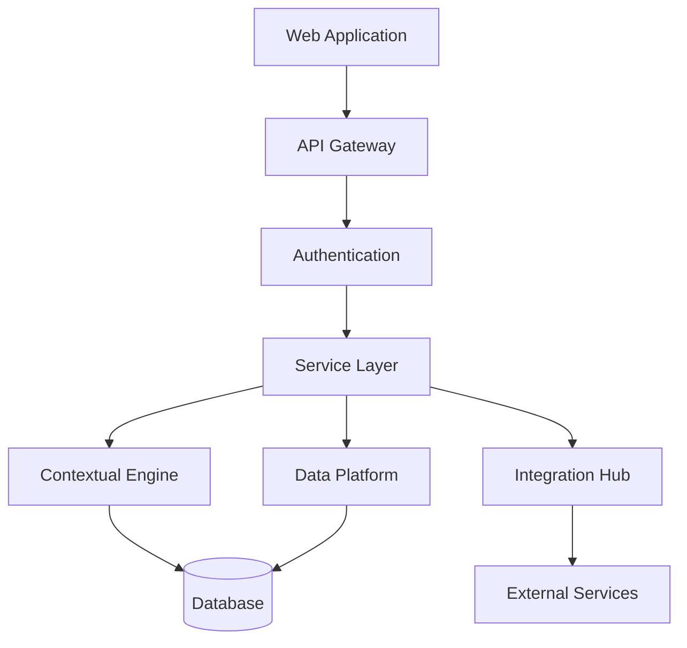

# COREos - AI-First Business Operating System

[](https://github.com/coreos/coreos/actions)
[](https://codecov.io/gh/coreos/coreos)
[](LICENSE)
[](api/status)
[](security/status)

COREos is an AI-first operating system designed to revolutionize how founders and businesses operate by providing intelligent, context-aware tools for decision-making and operational efficiency. The platform combines a powerful Contextual Engine, unified data platform, and AI-driven decision support powered by Llama models to deliver personalized insights and automate routine operations.

## Key Features

- 🧠 **Contextual Engine**: Dynamic business analysis and strategy generation using AI
- 🔄 **Unified Data Platform**: Centralized data management and cross-tool synchronization
- 📋 **Template System**: Pre-configured workflows and processes for rapid deployment
- 🔌 **Integration Framework**: Seamless connection with external tools and services
- 🤖 **AI Decision Support**: Predictive and prescriptive analytics using Llama models

## System Architecture



## Getting Started

### Prerequisites

- Docker 24+
- Python 3.11+
- Node.js 18+
- PostgreSQL 14+
- Redis 7+
- Kubernetes 1.25+
- Terraform 1.5+

### Quick Start

1. Clone the repository:
```bash
git clone https://github.com/coreos/coreos.git
cd coreos
```

2. Configure environment:
```bash
cp .env.example .env
# Edit .env with your configuration
```

3. Install dependencies:
```bash
# Backend dependencies
python -m venv venv
source venv/bin/activate
pip install -r requirements.txt

# Frontend dependencies
cd frontend
npm install
```

4. Start services:
```bash
docker-compose up -d
```

5. Run migrations:
```bash
python manage.py migrate
```

6. Initialize data:
```bash
python manage.py init_data
```

7. Verify installation:
```bash
python manage.py verify_setup
```

## Development

### Technology Stack

#### Frontend
- React 18+
- TypeScript 5.0+
- Redux Toolkit 1.9+
- React Query 4+
- Styled Components 6+

#### Backend
- FastAPI 0.100+
- SQLAlchemy 2.0+
- Pydantic 2.0+
- gRPC 1.56+
- Llama 2

#### Infrastructure
- Docker 24+
- Kubernetes 1.25+
- Terraform 1.5+
- Istio 1.18+
- ArgoCD

### Development Tools

#### Code Style
- Python: black, flake8, isort, mypy, bandit
- TypeScript: eslint, prettier, typescript-eslint, husky

#### Testing
- Backend: pytest 7+
- Frontend: jest 29+
- E2E: cypress 12+
- Performance: k6
- Security: owasp-zap

### Local Development

1. Start development environment:
```bash
make dev
```

2. Run tests:
```bash
# Backend tests
pytest

# Frontend tests
cd frontend && npm test

# E2E tests
npm run cypress
```

3. Code formatting:
```bash
# Backend
make format

# Frontend
npm run format
```

## Documentation

### API Documentation
- OpenAPI documentation available at `/api/docs`
- Swagger UI available at `/api/swagger`
- Detailed API guides in `/docs/api`

### Architecture Overview
- C4 model diagrams in `/docs/architecture`
- Component documentation in `/docs/components`
- Integration guides in `/docs/integrations`

### User Guide
- Getting started guide in `/docs/getting-started`
- Feature documentation in `/docs/features`
- Troubleshooting guide in `/docs/troubleshooting`

### Contributing
Please read [CONTRIBUTING.md](CONTRIBUTING.md) for details on our code of conduct and the process for submitting pull requests.

## Deployment

### Production Deployment
```bash
# Deploy infrastructure
terraform init
terraform apply

# Deploy application
kubectl apply -f k8s/
```

### Monitoring
- Prometheus metrics at `/metrics`
- Grafana dashboards for system monitoring
- Datadog integration for APM

## Security

Please review our [Security Policy](SECURITY.md) for reporting vulnerabilities and security best practices.

## License

This project is licensed under the MIT License - see the [LICENSE](LICENSE) file for details.

## Support

- 📚 Documentation: [docs.coreos.com](https://docs.coreos.com)
- 💬 Discord: [discord.gg/coreos](https://discord.gg/coreos)
- 🐛 Issue Tracker: [GitHub Issues](https://github.com/coreos/coreos/issues)
- 📧 Email: support@coreos.com

## Acknowledgments

- Llama team for the AI models
- Open source community
- Early adopters and contributors