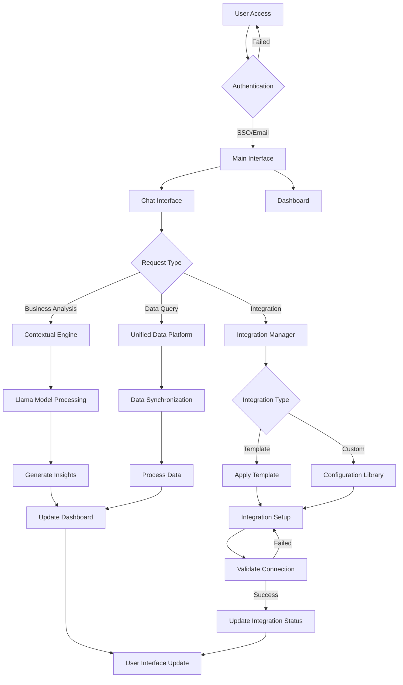
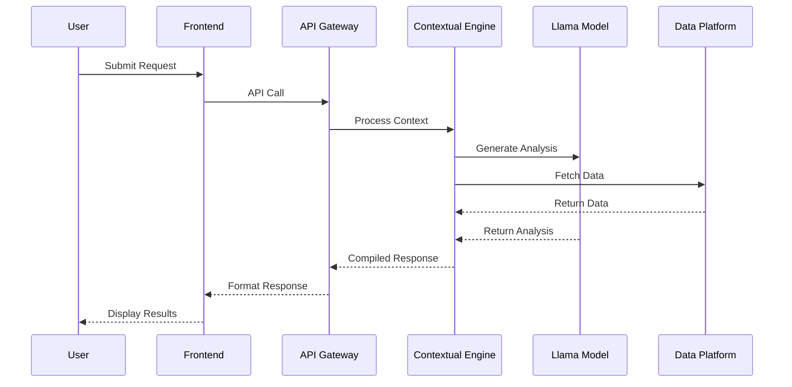
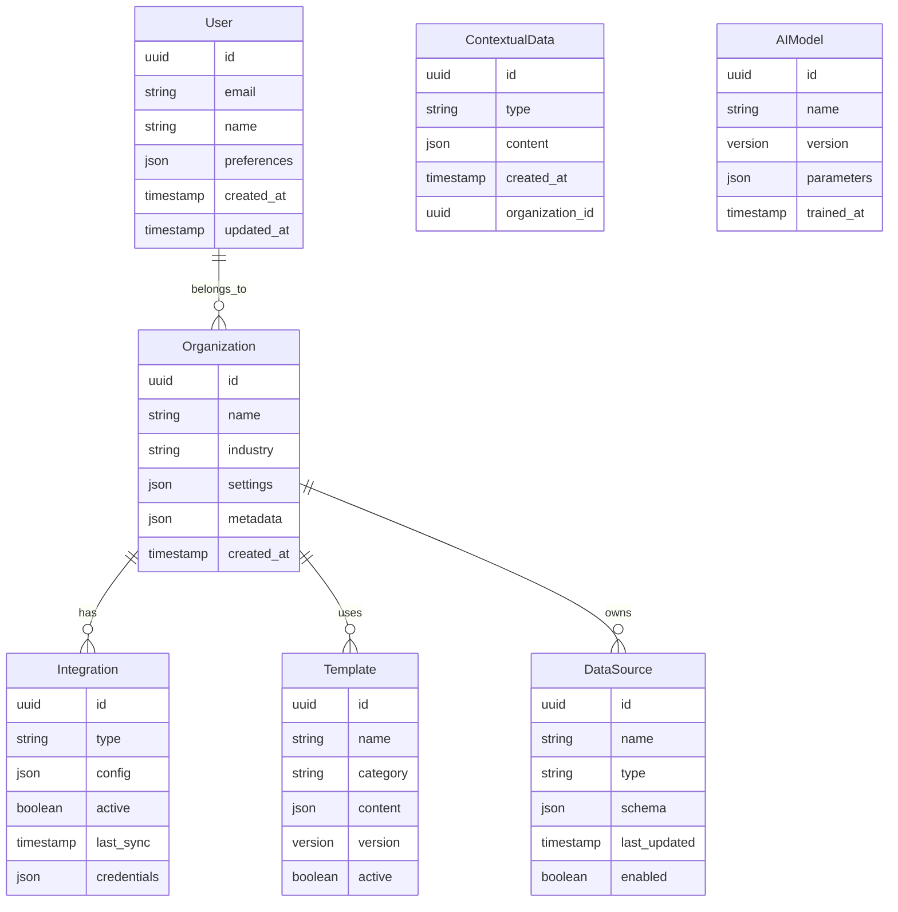
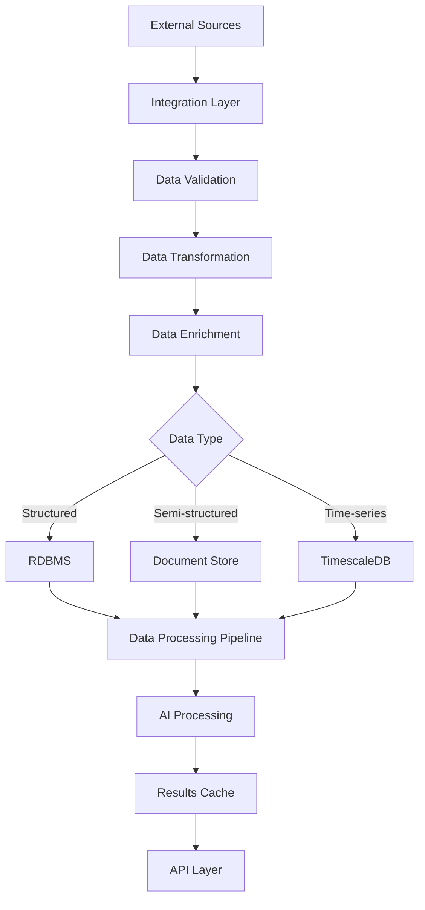

# Product Requirements Document (PRD)

# 1. INTRODUCTION

## 1.1 Purpose

This Software Requirements Specification (SRS) document provides a comprehensive description of the COREos platform - an AI-first operating system designed for founders and businesses. The document serves as the primary reference for technical and functional requirements, intended for:

- Development and engineering teams implementing the system
- Product managers and stakeholders overseeing the project
- QA teams validating system functionality
- Integration partners building external connections
- Technical writers creating documentation

## 1.2 Scope

COREos is a cloud-based platform that serves as an intelligent operating system for businesses, with the following core components:

- Contextual Engine for dynamic business insights and strategy generation
- Unified data platform integrating essential business functions
- AI-driven decision support system leveraging Llama models
- Template-based configuration system for rapid deployment
- Integration framework for external tool connectivity

The platform will:

- Provide an immersive, ChatGPT-inspired interface
- Deliver personalized insights through continuous learning
- Automate routine business operations
- Enable data-driven decision making
- Scale with business growth through modular architecture

Out of scope:

- Custom hardware requirements
- Offline-only functionality
- Direct financial transaction processing
- Industry-specific compliance certifications (Phase 1)
- Enterprise-scale deployments (Phase 1)

# 2. PRODUCT DESCRIPTION

## 2.1 Product Perspective

COREos operates as a cloud-based SaaS platform that integrates with existing business tools and infrastructure. The system architecture consists of:

- Web-based frontend accessible through modern browsers
- Microservices backend deployed across Azure and AWS
- Llama-based AI models for intelligent processing
- Integration layer for external tool connectivity
- Secure data storage and processing infrastructure

The platform functions independently while maintaining connections to:

- Third-party business tools and services
- Cloud infrastructure providers
- Authentication services (SSO providers)
- External data sources and APIs

## 2.2 Product Functions

The primary functions of COREos include:

1. Contextual Business Analysis

   - Dynamic strategy generation
   - SWOT analysis creation
   - Lean canvas development
   - Industry-specific insights

2. Unified Data Management

   - Centralized data repository
   - Cross-tool data synchronization
   - Automated data processing
   - Real-time analytics

3. AI-Powered Decision Support

   - Predictive analytics
   - Prescriptive recommendations
   - Natural language processing
   - Continuous learning

4. Template-Based Operations

   - Pre-configured workflows
   - Business process templates
   - Integration templates
   - Customizable configurations

5. Integration Management

   - External tool connectivity
   - API management
   - Data mapping
   - Configuration library

## 2.3 User Characteristics

Primary user personas include:

1. Startup Founders

   - Technical expertise: Varied
   - Business expertise: Early to intermediate
   - Needs: Quick setup, actionable insights
   - Usage pattern: Daily strategic planning

2. Business Operators

   - Technical expertise: Basic to intermediate
   - Business expertise: Intermediate
   - Needs: Operational efficiency, automation
   - Usage pattern: Regular operational tasks

3. Technical Implementers

   - Technical expertise: Advanced
   - Business expertise: Basic to intermediate
   - Needs: Integration capabilities, customization
   - Usage pattern: Setup and maintenance

## 2.4 Constraints

1. Technical Constraints

   - Limited to cloud deployment
   - Dependency on external API availability
   - Browser-based access only
   - Network connectivity required

2. Business Constraints

   - Phase 1 focus on individual business optimization
   - Limited enterprise features
   - Template-first approach to reduce customization
   - Initial focus on general business operations

3. Regulatory Constraints

   - Data privacy compliance requirements
   - Industry-specific regulations
   - Cross-border data handling restrictions
   - AI model usage limitations

## 2.5 Assumptions and Dependencies

Assumptions:

1. Users have stable internet connectivity
2. Modern web browser availability
3. Basic business tool literacy
4. English language proficiency
5. Access to standard business documentation

Dependencies:

1. External Services

   - Cloud infrastructure availability
   - SSO provider uptime
   - Third-party API stability
   - Integration partner reliability

2. Technical Dependencies

   - Llama model performance
   - FastAPI framework stability
   - Kubernetes ecosystem
   - Cloud provider services

3. Business Dependencies

   - Template library maintenance
   - Integration partner relationships
   - User feedback for AI learning
   - Community contribution for configurations

# 3. PROCESS FLOWCHART

```mermaid
graph TD
    subgraph "Data Processing Flow"
        A1[External Data Sources] --> B1[Integration Layer]
        B1 --> C1[Data Validation]
        C1 --> D1[Data Transformation]
        D1 --> E1[Unified Data Store]
        E1 --> F1[Analytics Engine]
        F1 --> G1[AI Processing]
        G1 --> H1[Results Cache]
    end
    
    subgraph "Business Logic Flow"
        A2[User Input] --> B2[Context Analysis]
        B2 --> C2[Template Selection]
        C2 --> D2[AI Model Selection]
        D2 --> E2[Process Execution]
        E2 --> F2[Result Generation]
        F2 --> G2[User Presentation]
    end
```







# 4. FUNCTIONAL REQUIREMENTS

## 4.1 Contextual Engine (CE)

### ID: CE-001

**Description**: Core AI-powered analysis engine that processes business data and user inputs to generate insights and strategies.
**Priority**: High

| Requirement ID | Requirement Description | Acceptance Criteria |
| --- | --- | --- |
| CE-001.1 | Generate dynamic SWOT analysis based on user inputs and industry data | - Produces comprehensive SWOT matrix<br>- Updates in real-time with new data<br>- Includes industry-specific insights |
| CE-001.2 | Create and maintain lean canvas documentation | - Auto-populates canvas sections<br>- Allows user modifications<br>- Exports in standard formats |
| CE-001.3 | Process natural language queries for business insights | - Handles complex business questions<br>- Provides contextual responses<br>- Response time \< 3 seconds |
| CE-001.4 | Learn from user interactions to improve recommendations | - Tracks user feedback<br>- Updates recommendation models<br>- Maintains user preference history |

## 4.2 Unified Data Platform (UDP)

### ID: UDP-001

**Description**: Centralized data management system integrating various business functions and external tools.
**Priority**: High

| Requirement ID | Requirement Description | Acceptance Criteria |
| --- | --- | --- |
| UDP-001.1 | Synchronize data across integrated tools | - Real-time sync capabilities<br>- Conflict resolution<br>- Data validation checks |
| UDP-001.2 | Maintain centralized data repository | - Scalable storage system<br>- Data versioning<br>- Backup mechanisms |
| UDP-001.3 | Process and transform data for analytics | - ETL pipeline functionality<br>- Data cleaning capabilities<br>- Format standardization |
| UDP-001.4 | Provide real-time analytics dashboard | - Custom metric tracking<br>- Visual data representations<br>- Export functionality |

## 4.3 Template System (TS)

### ID: TS-001

**Description**: Pre-configured workflows and business process templates for rapid deployment.
**Priority**: Medium

| Requirement ID | Requirement Description | Acceptance Criteria |
| --- | --- | --- |
| TS-001.1 | Provide business operation templates | - Industry-specific templates<br>- Customization options<br>- Version control |
| TS-001.2 | Support workflow automation | - Visual workflow builder<br>- Trigger configuration<br>- Error handling |
| TS-001.3 | Enable template sharing and import | - Template marketplace<br>- Import validation<br>- Rating system |
| TS-001.4 | Maintain template version control | - Version history<br>- Rollback capability<br>- Change documentation |

## 4.4 Integration Framework (IF)

### ID: IF-001

**Description**: System for managing external tool connections and data flow.
**Priority**: High

| Requirement ID | Requirement Description | Acceptance Criteria |
| --- | --- | --- |
| IF-001.1 | Support standard API integrations | - REST API support<br>- Authentication handling<br>- Rate limiting |
| IF-001.2 | Provide configuration library | - Pre-built configurations<br>- Custom config options<br>- Config validation |
| IF-001.3 | Monitor integration health | - Status monitoring<br>- Error notifications<br>- Performance metrics |
| IF-001.4 | Handle data mapping and transformation | - Field mapping interface<br>- Transform rules<br>- Data validation |

## 4.5 AI Decision Support (ADS)

### ID: ADS-001

**Description**: Llama-based AI system for predictive analytics and decision support.
**Priority**: High

| Requirement ID | Requirement Description | Acceptance Criteria |
| --- | --- | --- |
| ADS-001.1 | Generate predictive insights | - Accuracy metrics<br>- Confidence scores<br>- Historical validation |
| ADS-001.2 | Provide prescriptive recommendations | - Action-oriented suggestions<br>- Priority ranking<br>- Implementation steps |
| ADS-001.3 | Process natural language inputs | - Multi-language support<br>- Context awareness<br>- Response accuracy |
| ADS-001.4 | Maintain learning capabilities | - Model updating<br>- Performance tracking<br>- Feedback integration |

# 5. NON-FUNCTIONAL REQUIREMENTS

## 5.1 Performance Requirements

| Category | Requirement | Target Metric |
| --- | --- | --- |
| Response Time | Chat interface response | \< 1 second |
|  | AI model inference | \< 3 seconds |
|  | Dashboard updates | \< 2 seconds |
|  | Integration sync | \< 5 seconds |
| Throughput | Concurrent users per instance | 1000+ |
|  | API requests per second | 500+ |
|  | Data processing capacity | 100GB/day |
| Resource Usage | CPU utilization | \< 70% average |
|  | Memory usage | \< 80% capacity |
|  | Storage IOPS | 3000+ |
|  | Network bandwidth | 1Gbps minimum |

## 5.2 Safety Requirements

| Requirement | Description | Implementation |
| --- | --- | --- |
| Data Backup | Regular automated backups | - Daily incremental backups<br>- Weekly full backups<br>- 30-day retention |
| Disaster Recovery | Business continuity plan | - Multi-region failover<br>- RPO \< 15 minutes<br>- RTO \< 1 hour |
| Error Handling | Graceful failure management | - Circuit breakers<br>- Fallback mechanisms<br>- Error logging |
| Data Integrity | Prevent data corruption | - Checksums<br>- Version control<br>- Audit trails |

## 5.3 Security Requirements

| Category | Requirement | Specification |
| --- | --- | --- |
| Authentication | Multi-factor authentication | - SSO integration<br>- 2FA support<br>- Password policies |
| Authorization | Role-based access control | - Granular permissions<br>- Least privilege principle<br>- Session management |
| Encryption | Data protection | - TLS 1.3 in transit<br>- AES-256 at rest<br>- Key rotation |
| Privacy | Data handling | - Data anonymization<br>- Consent management<br>- Access controls |
| Monitoring | Security operations | - Real-time alerts<br>- Audit logging<br>- Intrusion detection |

## 5.4 Quality Requirements

### 5.4.1 Availability

- System uptime: 99.9%
- Planned maintenance windows: \< 4 hours/month
- Automated failover capability
- Load balancing across regions

### 5.4.2 Maintainability

- Modular architecture with microservices
- Automated deployment pipelines
- Comprehensive documentation
- Code coverage \> 80%
- Automated testing suite

### 5.4.3 Usability

- Mobile-responsive design
- Accessibility compliance (WCAG 2.1)
- Maximum 3 clicks to key functions
- Consistent UI/UX patterns
- Multi-language support (Phase 2)

### 5.4.4 Scalability

- Horizontal scaling capability
- Auto-scaling based on load
- Database sharding support
- Microservices independence
- Containerized deployment

### 5.4.5 Reliability

- Mean Time Between Failures (MTBF): \> 720 hours
- Mean Time To Recovery (MTTR): \< 30 minutes
- Error rate: \< 0.1%
- Data durability: 99.999999999%

## 5.5 Compliance Requirements

| Requirement | Standard | Implementation |
| --- | --- | --- |
| Data Protection | GDPR | - Data processing agreements<br>- Privacy controls<br>- Right to be forgotten |
| Security | SOC 2 Type II | - Security controls<br>- Audit procedures<br>- Compliance monitoring |
| Cloud Security | ISO 27001 | - Information security management<br>- Risk assessment<br>- Security policies |
| API Standards | OpenAPI 3.0 | - API documentation<br>- Version control<br>- Deprecation policies |
| Accessibility | WCAG 2.1 | - AA compliance<br>- Accessibility testing<br>- Regular audits |

# 6. DATA REQUIREMENTS

## 6.1 Data Models



## 6.2 Data Storage

| Data Type | Storage Solution | Retention Period | Backup Frequency |
| --- | --- | --- | --- |
| User Data | PostgreSQL | Indefinite | Daily |
| Analytics Data | TimescaleDB | 24 months | Weekly |
| Model Data | MongoDB | 12 months | Daily |
| File Storage | S3-compatible | 6 months | Weekly |
| Cache Data | Redis | 24 hours | None |
| Logs | Elasticsearch | 3 months | Monthly |

### 6.2.1 Redundancy Requirements

- Primary data: Triple redundancy across availability zones
- Backup data: Cross-region replication
- Cache data: Master-slave replication with automatic failover
- Critical user data: 99.999999999% durability guarantee

### 6.2.2 Backup Strategy

- Full backups: Weekly
- Incremental backups: Daily
- Point-in-time recovery: 30 days
- Backup encryption: AES-256
- Backup testing: Monthly validation

### 6.2.3 Recovery Procedures

- RTO (Recovery Time Objective): \< 1 hour
- RPO (Recovery Point Objective): \< 15 minutes
- Automated failover for critical systems
- Geographic redundancy for disaster recovery

## 6.3 Data Processing



### 6.3.1 Data Security Requirements

| Security Layer | Implementation | Standard |
| --- | --- | --- |
| Encryption at Rest | AES-256 | FIPS 140-2 |
| Encryption in Transit | TLS 1.3 | PFS |
| Access Control | RBAC + ABAC | OAuth 2.0 |
| Data Masking | Dynamic masking | PII protection |
| Audit Logging | Immutable logs | SOC 2 |

### 6.3.2 Data Processing Rules

1. Data Ingestion

   - Validation against schema
   - Sanitization of inputs
   - Rate limiting
   - Deduplication

2. Data Transformation

   - Schema normalization
   - Format standardization
   - Enrichment with metadata
   - Quality checks

3. Data Access

   - Authentication required
   - Authorization checks
   - Rate limiting
   - Audit logging

### 6.3.3 Data Quality Requirements

- Completeness: \> 99%
- Accuracy: \> 99.9%
- Consistency: 100%
- Timeliness: \< 5 minute lag
- Validity: 100% schema compliance

# 7. EXTERNAL INTERFACES

## 7.1 User Interfaces

### 7.1.1 Web Application Interface

| Component | Description | Requirements |
| --- | --- | --- |
| Chat Interface | ChatGPT-inspired conversational UI | - Persistent chat window<br>- Message history<br>- Rich text formatting<br>- File attachment support |
| Dashboard | MacOS-inspired clean layout | - Customizable widgets<br>- Real-time updates<br>- Responsive design<br>- Dark/light mode |
| Integration Manager | Tool configuration interface | - Visual connection status<br>- Configuration wizard<br>- Template library access<br>- Error notifications |
| Template Library | Pre-built configuration browser | - Category filtering<br>- Search functionality<br>- Preview capability<br>- One-click deployment |

### 7.1.2 Mobile Responsiveness

| Breakpoint | Layout Adjustments |
| --- | --- |
| Desktop (\>1200px) | Full feature set with multi-column layout |
| Tablet (768px-1199px) | Condensed navigation, single-column layout |
| Mobile (\<767px) | Simplified interface, touch-optimized elements |

## 7.2 Software Interfaces

### 7.2.1 External Service Integration

| Service Type | Interface Method | Data Format |
| --- | --- | --- |
| CRM Systems | REST API | JSON/XML |
| Document Management | OAuth 2.0 + REST | JSON |
| Analytics Platforms | GraphQL | JSON |
| Cloud Storage | S3 API | Binary/JSON |
| Authentication | OAuth 2.0/OIDC | JWT |

### 7.2.2 Internal Component Interfaces

| Component | Protocol | Format | Purpose |
| --- | --- | --- | --- |
| Frontend → API Gateway | HTTPS/WSS | JSON | User requests |
| API Gateway → Services | gRPC | Protocol Buffers | Internal communication |
| Services → Database | TCP | Native protocols | Data persistence |
| Services → Cache | Redis Protocol | Binary | Performance optimization |

## 7.3 Communication Interfaces

### 7.3.1 Network Protocols

| Protocol | Usage | Requirements |
| --- | --- | --- |
| HTTPS | Secure web traffic | TLS 1.3, Perfect Forward Secrecy |
| WebSocket | Real-time updates | WSS, compression support |
| gRPC | Service communication | HTTP/2, TLS |
| TCP/IP | Database connections | Encrypted tunnels |

### 7.3.2 API Specifications

```yaml
openapi: 3.0.0
paths:
  /api/v1:
    authentication:
      - Bearer JWT
      - API Key
    rate_limiting:
      - 500 requests/minute
    formats:
      - application/json
      - multipart/form-data
    versioning:
      - URI-based
      - Header-based
```

### 7.3.3 Integration Patterns

| Pattern | Implementation | Use Case |
| --- | --- | --- |
| Event-Driven | Apache Kafka | Real-time updates |
| Request-Response | REST/GraphQL | CRUD operations |
| Publish-Subscribe | Redis Pub/Sub | Notifications |
| Message Queue | RabbitMQ | Async processing |

## 7.4 Cloud Provider Interfaces

| Provider | Service | Interface Type |
| --- | --- | --- |
| AWS | S3 | AWS SDK/API |
| AWS | Lambda | Function triggers |
| Azure | Blob Storage | Azure SDK/API |
| Azure | Functions | HTTP triggers |
| Both | Kubernetes | Container orchestration |

### 7.4.1 Infrastructure Interface Requirements

```yaml
infrastructure:
  compute:
    - kubernetes_api: v1.25+
    - container_runtime: containerd
  storage:
    - object_storage_api: S3 compatible
    - block_storage_api: CSI interface
  networking:
    - load_balancer: Cloud native
    - service_mesh: Istio
  monitoring:
    - metrics: Prometheus compatible
    - logging: OpenTelemetry
```

# 8. APPENDICES

## 8.1 GLOSSARY

| Term | Definition |
| --- | --- |
| Contextual Engine | Core AI system that processes business data and user inputs to generate dynamic insights and strategies |
| Template Library | Collection of pre-configured workflows and business process templates for rapid deployment |
| Integration Framework | System for managing external tool connections and data flow between COREos and third-party services |
| Unified Data Platform | Centralized system for managing and processing data from multiple business functions and sources |
| Network Effects | The phenomenon where the value of COREos increases as more users contribute data and interactions |
| Super-user | Advanced users with elevated permissions for system customization and configuration |

## 8.2 ACRONYMS

| Acronym | Definition |
| --- | --- |
| ABAC | Attribute-Based Access Control |
| API | Application Programming Interface |
| CSI | Container Storage Interface |
| ETL | Extract, Transform, Load |
| GDPR | General Data Protection Regulation |
| IaC | Infrastructure as Code |
| IOPS | Input/Output Operations Per Second |
| JWT | JSON Web Token |
| MSP | Managed Service Provider |
| OIDC | OpenID Connect |
| PFS | Perfect Forward Secrecy |
| PII | Personally Identifiable Information |
| RBAC | Role-Based Access Control |
| RPO | Recovery Point Objective |
| RTO | Recovery Time Objective |
| SaaS | Software as a Service |
| SOC | Service Organization Control |
| SSO | Single Sign-On |
| SWOT | Strengths, Weaknesses, Opportunities, Threats |
| WSS | WebSocket Secure |

## 8.3 ADDITIONAL REFERENCES

| Category | Reference | Purpose |
| --- | --- | --- |
| AI Models | [Llama Model Documentation](https://github.com/facebookresearch/llama) | Technical details for AI implementation |
| Cloud Infrastructure | [Azure Architecture Center](https://docs.microsoft.com/azure/architecture) | Cloud deployment patterns |
| API Design | [OpenAPI Specification](https://swagger.io/specification) | API documentation standards |
| Security | [OWASP Security Guidelines](https://owasp.org/www-project-web-security-testing-guide) | Security best practices |
| Containerization | [Kubernetes Documentation](https://kubernetes.io/docs) | Container orchestration reference |
| Data Protection | [GDPR Compliance Checklist](https://gdpr.eu/checklist) | Regulatory compliance guidance |
| Authentication | [OAuth 2.0 Specifications](https://oauth.net/2) | Authentication implementation |
| Monitoring | [OpenTelemetry Documentation](https://opentelemetry.io/docs) | Observability standards |