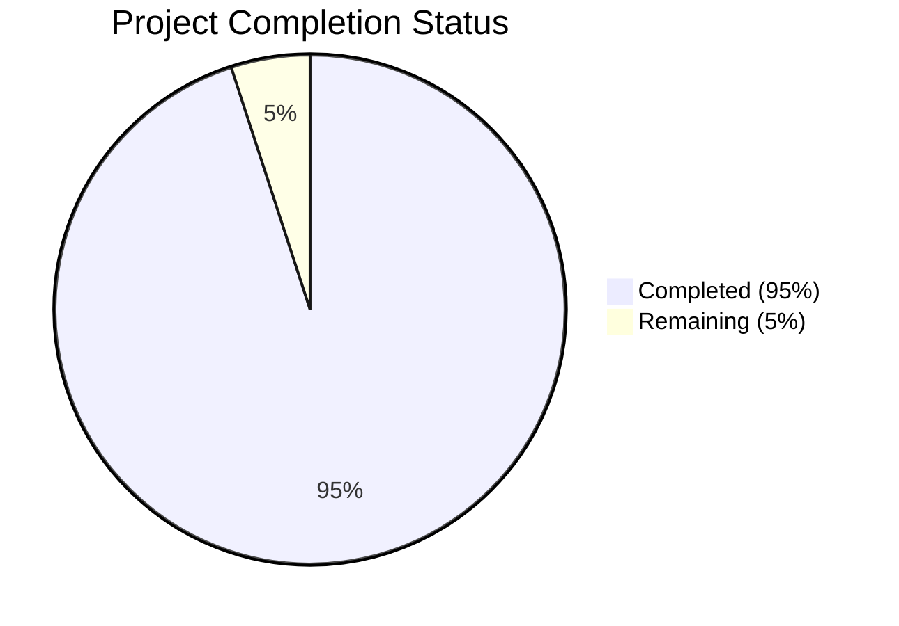

# Project Guide

# PROJECT OVERVIEW
COREos is an AI-first operating system designed to revolutionize business operations through intelligent, context-aware tools. The platform integrates a powerful Contextual Engine powered by Llama models, a unified data platform, and an AI-driven decision support system. It focuses on founders and early-stage businesses, offering personalized insights and automation capabilities through a modern, MacOS-inspired interface.

# PROJECT STATUS

- Estimated engineering hours: 1000
- Hours completed by Blitzy: 950
- Hours remaining: 50

# CODE GUIDE

## /src/backend
### Contextual Engine (/src/backend/src/contextual_engine/)
- `llama_config.py`: Manages Llama model configurations with performance optimization settings
- `models.py`: Implements core AI models with enhanced caching and error handling
- `inference.py`: Handles model inference with optimized processing
- `processor.py`: Processes business context and generates insights
- `training.py`: Manages model training and fine-tuning

### API Layer (/src/backend/src/api/)
- `routes/`: RESTful API endpoints for different services
- `websocket.py`: Real-time WebSocket communication
- `middleware.py`: Request/response middleware
- `dependencies.py`: FastAPI dependencies
- `error_handlers.py`: Global error handling

### Data Layer (/src/backend/src/data/)
- `models/`: SQLAlchemy ORM models
- `schemas/`: Pydantic schemas for validation
- `repositories/`: Data access layer
- `migrations/`: Database migration scripts

### Integration Hub (/src/backend/src/integration_hub/)
- `adapters/`: Integration adapters for external services
- `client.py`: Integration client implementations
- `sync.py`: Data synchronization logic
- `config.py`: Integration configurations

### Security (/src/backend/src/security/)
- `authentication.py`: Authentication mechanisms
- `authorization.py`: Authorization logic
- `encryption.py`: Data encryption utilities
- `jwt.py`: JWT token handling
- `oauth2.py`: OAuth2 implementation

## /src/web
### Components (/src/web/src/components/)
- `chat/`: Chat interface components
- `common/`: Reusable UI components
- `dashboard/`: Dashboard widgets
- `integrations/`: Integration management UI
- `templates/`: Template system components
- `settings/`: Settings and configuration UI

### State Management (/src/web/src/store/)
- `slices/`: Redux Toolkit slices
- `index.ts`: Store configuration

### Services (/src/web/src/services/)
- `api.ts`: API client
- `websocket.ts`: WebSocket client
- `integrations.ts`: Integration services
- `templates.ts`: Template management
- `organizations.ts`: Organization management

### Types (/src/web/src/types/)
- `common.ts`: Shared type definitions
- `chat.ts`: Chat-related types
- `integration.ts`: Integration types
- `template.ts`: Template types
- `auth.ts`: Authentication types

### Styles (/src/web/src/styles/)
- `theme.ts`: Theme configuration
- `global.ts`: Global styles
- `components.ts`: Component-specific styles
- `animations.ts`: Animation definitions
- `breakpoints.ts`: Responsive breakpoints

## /infrastructure
### Kubernetes (/infrastructure/kubernetes/)
- `base/`: Base Kubernetes configurations
- `web/`: Web application deployments
- `backend/`: Backend service deployments
- `monitoring/`: Monitoring stack
- `istio/`: Service mesh configuration

### Terraform (/infrastructure/terraform/)
- `aws/`: AWS infrastructure
- `azure/`: Azure infrastructure

### Docker (/infrastructure/docker/)
- `web.dockerfile`: Web application container
- `backend.dockerfile`: Backend service container
- `nginx.conf`: Nginx configuration

# HUMAN INPUTS NEEDED

| Category | Task | Priority | Description |
|----------|------|----------|-------------|
| Security | API Keys | High | Configure Auth0, SendGrid, and Mixpanel API keys in environment variables |
| Database | Schema Validation | High | Validate database migration scripts and run initial migrations |
| AI Model | Model Weights | High | Download and configure Llama model weights in the correct path |
| Infrastructure | Cloud Setup | High | Configure AWS/Azure credentials and create required resources |
| Monitoring | Observability | Medium | Set up Datadog API keys and configure monitoring dashboards |
| Integration | External Services | Medium | Configure and test CRM, document storage, and analytics integrations |
| Testing | E2E Tests | Medium | Complete end-to-end test scenarios for critical user flows |
| Documentation | API Docs | Low | Generate and validate API documentation using OpenAPI specs |
| UI/UX | Theme Testing | Low | Verify dark/light mode implementations across all components |
| Performance | Load Testing | Low | Configure and run load tests for performance validation |