# Technical Specifications

# 1. INTRODUCTION

## 1.1 EXECUTIVE SUMMARY

COREos is an AI-first operating system designed to revolutionize how founders and businesses operate by providing intelligent, context-aware tools for decision-making and operational efficiency. The platform addresses the critical challenge of fragmented business tools and disconnected data by offering a unified, AI-driven interface that learns and evolves with each business's unique needs.

The system combines a powerful Contextual Engine, unified data platform, and AI-driven decision support powered by Llama models to deliver personalized insights and automate routine operations. By focusing on founders and early-stage businesses, COREos aims to reduce operational friction and accelerate growth through intelligent automation and data-driven decision making.

## 1.2 SYSTEM OVERVIEW

### Project Context

| Aspect | Description |
|--------|-------------|
| Market Position | First-to-market AI-first business operating system focused on founders and startups |
| Current Limitations | Fragmented tool landscape, manual decision processes, disconnected data silos |
| Enterprise Integration | Cloud-native architecture supporting standard enterprise tools and SSO providers |

### High-Level Description

| Component | Purpose |
|-----------|----------|
| Contextual Engine | Dynamic business analysis and strategy generation using AI |
| Unified Data Platform | Centralized data management and cross-tool synchronization |
| Template System | Pre-configured workflows and processes for rapid deployment |
| Integration Framework | Seamless connection with external tools and services |
| AI Decision Support | Predictive and prescriptive analytics using Llama models |

### Success Criteria

| Category | Metrics |
|----------|----------|
| User Adoption | - 80% user retention after first month<br>- 50% daily active users<br>- 90% template utilization rate |
| System Performance | - 99.9% system uptime<br>- < 3 second response time for AI operations<br>- 100% data accuracy |
| Business Impact | - 40% reduction in decision-making time<br>- 60% improvement in operational efficiency<br>- 30% increase in data-driven decisions |

## 1.3 SCOPE

### In-Scope Elements

| Category | Components |
|----------|------------|
| Core Features | - Contextual Engine processing<br>- Unified data management<br>- AI-driven insights<br>- Template-based operations<br>- External tool integration |
| User Workflows | - Business analysis and planning<br>- Operational task automation<br>- Data synchronization<br>- Integration management |
| Technical Implementation | - Cloud deployment (AWS/Azure)<br>- Web-based interface<br>- API-first architecture<br>- Microservices infrastructure |
| Data Management | - Business operational data<br>- User interaction data<br>- Integration configurations<br>- AI model training data |

### Out-of-Scope Elements

| Category | Exclusions |
|----------|------------|
| Features | - Offline-only operation<br>- Custom hardware requirements<br>- Direct financial transactions<br>- Industry-specific compliance certifications |
| Technical | - On-premises deployment<br>- Legacy system support<br>- Custom AI model hosting<br>- Enterprise-scale deployments |
| Implementation | - Phase 2 capabilities<br>- Multi-language support<br>- Advanced customization options<br>- Infrastructure abstraction services |
| Market Coverage | - Enterprise organizations<br>- Regulated industries<br>- Non-English markets<br>- Hardware/IoT integration |

# 2. SYSTEM ARCHITECTURE

## 2.1 High-Level Architecture

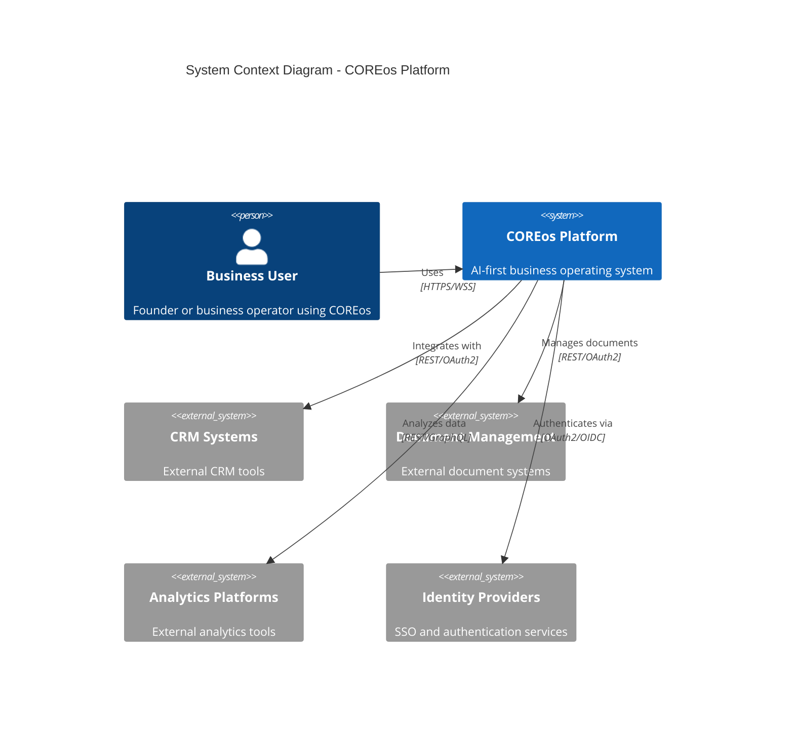
```mermaid
C4Context
    title System Context Diagram - COREos Platform

    Person(user, "Business User", "Founder or business operator using COREos")
    System(coreos, "COREos Platform", "AI-first business operating system")
    
    System_Ext(crm, "CRM Systems", "External CRM tools")
    System_Ext(docs, "Document Management", "External document systems")
    System_Ext(analytics, "Analytics Platforms", "External analytics tools")
    System_Ext(auth, "Identity Providers", "SSO and authentication services")
    
    Rel(user, coreos, "Uses", "HTTPS/WSS")
    Rel(coreos, crm, "Integrates with", "REST/OAuth2")
    Rel(coreos, docs, "Manages documents", "REST/OAuth2")
    Rel(coreos, analytics, "Analyzes data", "REST/GraphQL")
    Rel(coreos, auth, "Authenticates via", "OAuth2/OIDC")
```

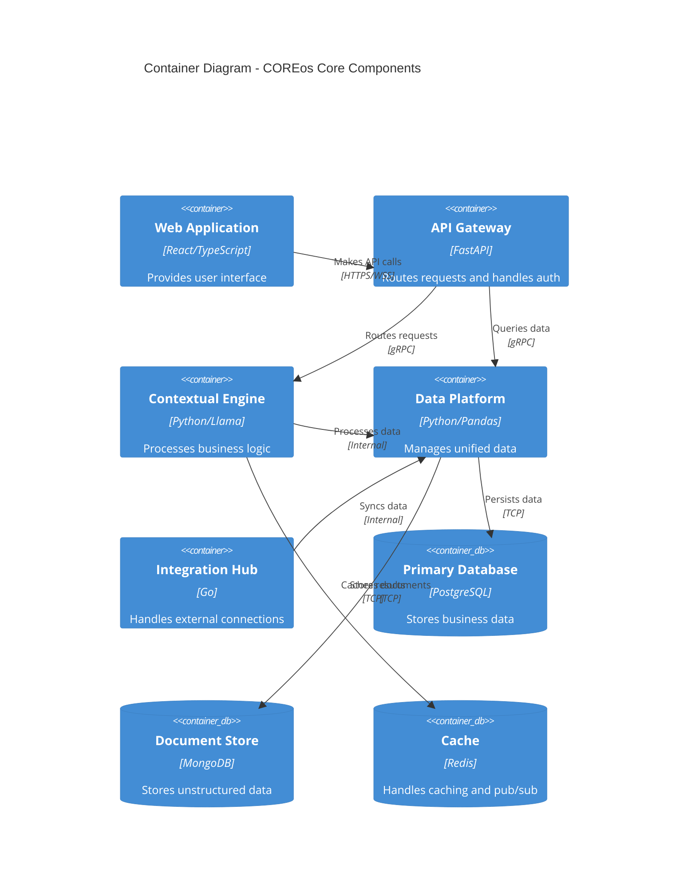
```mermaid
C4Container
    title Container Diagram - COREos Core Components

    Container(web, "Web Application", "React/TypeScript", "Provides user interface")
    Container(api, "API Gateway", "FastAPI", "Routes requests and handles auth")
    Container(context, "Contextual Engine", "Python/Llama", "Processes business logic")
    Container(data, "Data Platform", "Python/Pandas", "Manages unified data")
    Container(integration, "Integration Hub", "Go", "Handles external connections")
    
    ContainerDb(postgres, "Primary Database", "PostgreSQL", "Stores business data")
    ContainerDb(mongo, "Document Store", "MongoDB", "Stores unstructured data")
    ContainerDb(redis, "Cache", "Redis", "Handles caching and pub/sub")
    
    Rel(web, api, "Makes API calls", "HTTPS/WSS")
    Rel(api, context, "Routes requests", "gRPC")
    Rel(api, data, "Queries data", "gRPC")
    Rel(context, data, "Processes data", "Internal")
    Rel(integration, data, "Syncs data", "Internal")
    
    Rel(data, postgres, "Persists data", "TCP")
    Rel(data, mongo, "Stores documents", "TCP")
    Rel(context, redis, "Caches results", "TCP")
```

## 2.2 Component Details

| Component | Purpose | Technologies | Interfaces | Data Storage | Scaling |
|-----------|---------|--------------|------------|--------------|---------|
| Web Application | User interface | React, TypeScript, Redux | REST/WebSocket | Browser Storage | Horizontal |
| API Gateway | Request routing | FastAPI, Python | REST/gRPC | Redis Cache | Horizontal |
| Contextual Engine | Business logic | Python, Llama | gRPC | MongoDB | Vertical |
| Data Platform | Data management | Python, Pandas | gRPC | PostgreSQL | Horizontal |
| Integration Hub | External connectivity | Go | REST/GraphQL | Redis Queue | Horizontal |

## 2.3 Technical Decisions

### Architecture Style: Microservices

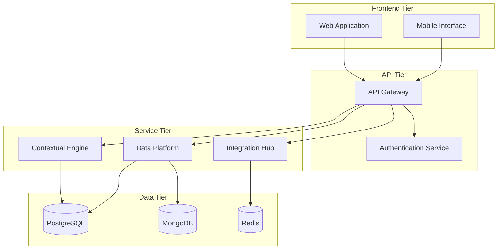
```mermaid
graph TD
    subgraph "Frontend Tier"
        A[Web Application]
        B[Mobile Interface]
    end
    
    subgraph "API Tier"
        C[API Gateway]
        D[Authentication Service]
    end
    
    subgraph "Service Tier"
        E[Contextual Engine]
        F[Data Platform]
        G[Integration Hub]
    end
    
    subgraph "Data Tier"
        H[(PostgreSQL)]
        I[(MongoDB)]
        J[(Redis)]
    end
    
    A --> C
    B --> C
    C --> D
    C --> E
    C --> F
    C --> G
    E --> H
    F --> H
    F --> I
    G --> J
```

### Communication Patterns

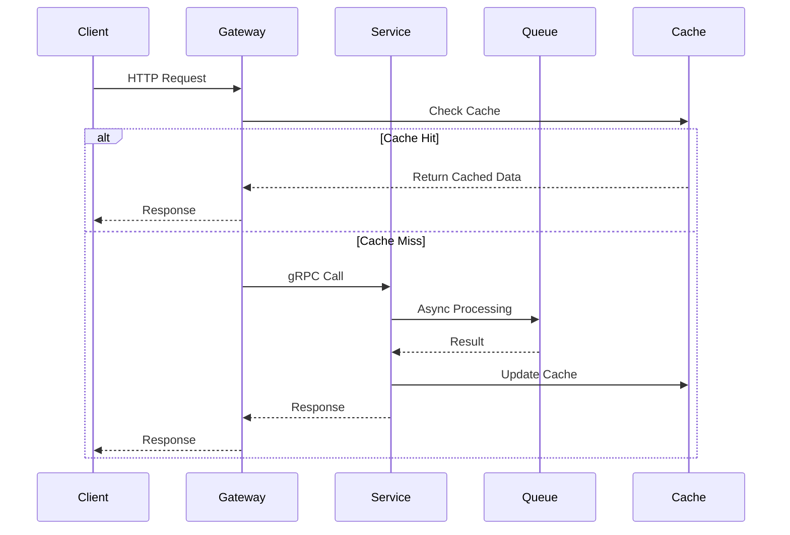
```mermaid
sequenceDiagram
    participant Client
    participant Gateway
    participant Service
    participant Queue
    participant Cache
    
    Client->>Gateway: HTTP Request
    Gateway->>Cache: Check Cache
    alt Cache Hit
        Cache-->>Gateway: Return Cached Data
        Gateway-->>Client: Response
    else Cache Miss
        Gateway->>Service: gRPC Call
        Service->>Queue: Async Processing
        Queue-->>Service: Result
        Service->>Cache: Update Cache
        Service-->>Gateway: Response
        Gateway-->>Client: Response
    end
```

## 2.4 Cross-Cutting Concerns

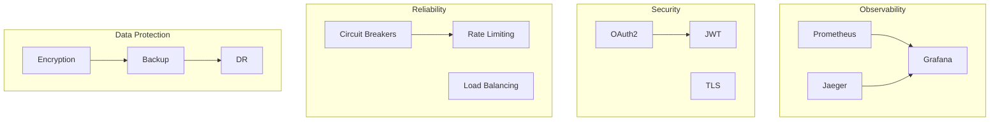
```mermaid
graph TD
    subgraph "Observability"
        A[Prometheus]
        B[Grafana]
        C[Jaeger]
    end
    
    subgraph "Security"
        D[OAuth2]
        E[JWT]
        F[TLS]
    end
    
    subgraph "Reliability"
        G[Circuit Breakers]
        H[Rate Limiting]
        I[Load Balancing]
    end
    
    subgraph "Data Protection"
        J[Encryption]
        K[Backup]
        L[DR]
    end
    
    A --> B
    C --> B
    D --> E
    G --> H
    J --> K
    K --> L
```

## 2.5 Deployment Architecture

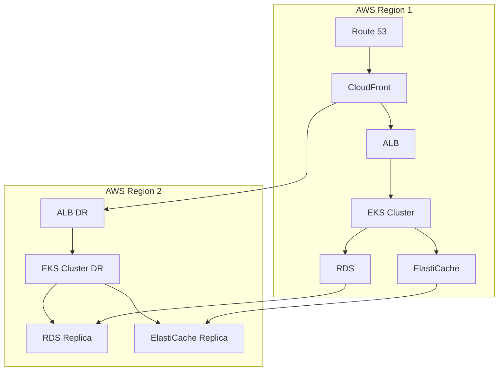
```mermaid
graph TD
    subgraph "AWS Region 1"
        A[Route 53]
        B[CloudFront]
        C[ALB]
        D[EKS Cluster]
        E[RDS]
        F[ElastiCache]
    end
    
    subgraph "AWS Region 2"
        G[ALB DR]
        H[EKS Cluster DR]
        I[RDS Replica]
        J[ElastiCache Replica]
    end
    
    A --> B
    B --> C
    B --> G
    C --> D
    D --> E
    D --> F
    G --> H
    H --> I
    H --> J
    E --> I
    F --> J
```

### Infrastructure Requirements

| Component | Specification | High Availability |
|-----------|--------------|-------------------|
| Load Balancer | AWS ALB/Azure Front Door | Multi-region |
| Kubernetes | EKS/AKS v1.25+ | Multi-zone |
| Database | PostgreSQL 14+ | Active-passive |
| Cache | Redis 6+ | Active-active |
| Storage | S3/Azure Blob | Cross-region |
| CDN | CloudFront/Azure CDN | Global edge |

# 3. SYSTEM COMPONENTS ARCHITECTURE

## 3.1 USER INTERFACE DESIGN

### 3.1.1 Design Specifications

| Category | Requirements | Implementation Details |
|----------|--------------|------------------------|
| Visual Hierarchy | MacOS-inspired clean interface | - Consistent spacing (8px grid)<br>- Typography scale (1.2 ratio)<br>- Z-index layers (100-900) |
| Component Library | Custom React component system | - Atomic design principles<br>- Storybook documentation<br>- Styled-components |
| Responsive Design | Mobile-first approach | - Breakpoints: 320px, 768px, 1024px, 1440px<br>- Fluid typography<br>- Flexible grids |
| Accessibility | WCAG 2.1 AA compliance | - ARIA labels<br>- Keyboard navigation<br>- Screen reader support |
| Browser Support | Modern browsers only | - Chrome 90+<br>- Firefox 88+<br>- Safari 14+<br>- Edge 90+ |
| Theme Support | Dark/Light modes | - CSS variables<br>- Theme context<br>- System preference detection |

### 3.1.2 Interface Elements

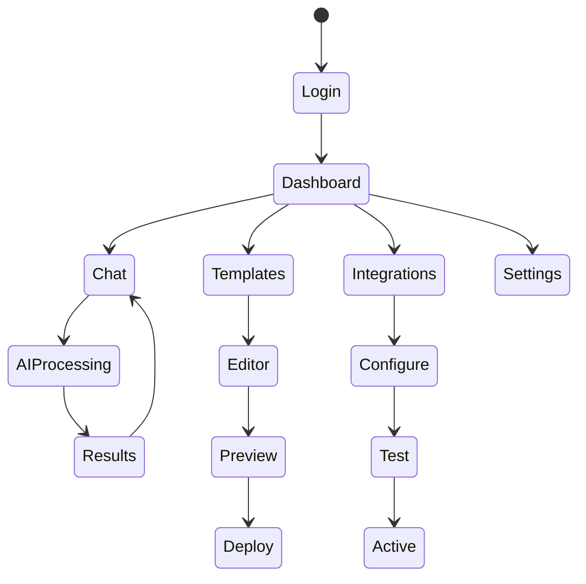
```mermaid
stateDiagram-v2
    [*] --> Login
    Login --> Dashboard
    Dashboard --> Chat
    Dashboard --> Templates
    Dashboard --> Integrations
    Dashboard --> Settings
    
    Chat --> AIProcessing
    AIProcessing --> Results
    Results --> Chat
    
    Templates --> Editor
    Editor --> Preview
    Preview --> Deploy
    
    Integrations --> Configure
    Configure --> Test
    Test --> Active
```

### 3.1.3 Critical User Flows

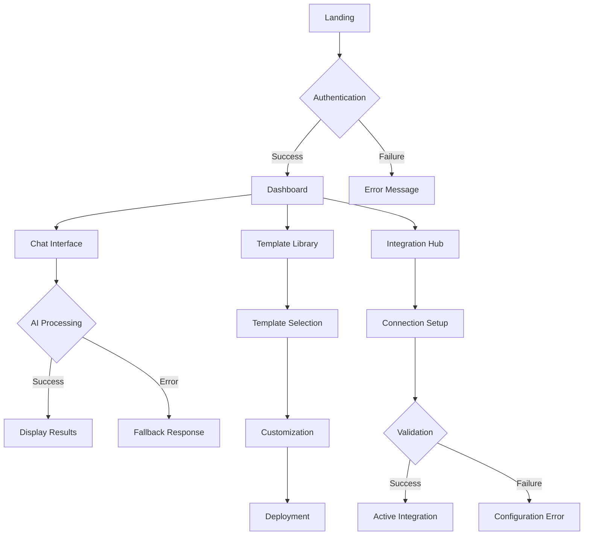
```mermaid
graph TD
    A[Landing] --> B{Authentication}
    B -->|Success| C[Dashboard]
    B -->|Failure| D[Error Message]
    
    C --> E[Chat Interface]
    C --> F[Template Library]
    C --> G[Integration Hub]
    
    E --> H{AI Processing}
    H -->|Success| I[Display Results]
    H -->|Error| J[Fallback Response]
    
    F --> K[Template Selection]
    K --> L[Customization]
    L --> M[Deployment]
    
    G --> N[Connection Setup]
    N --> O{Validation}
    O -->|Success| P[Active Integration]
    O -->|Failure| Q[Configuration Error]
```

## 3.2 DATABASE DESIGN

### 3.2.1 Schema Design

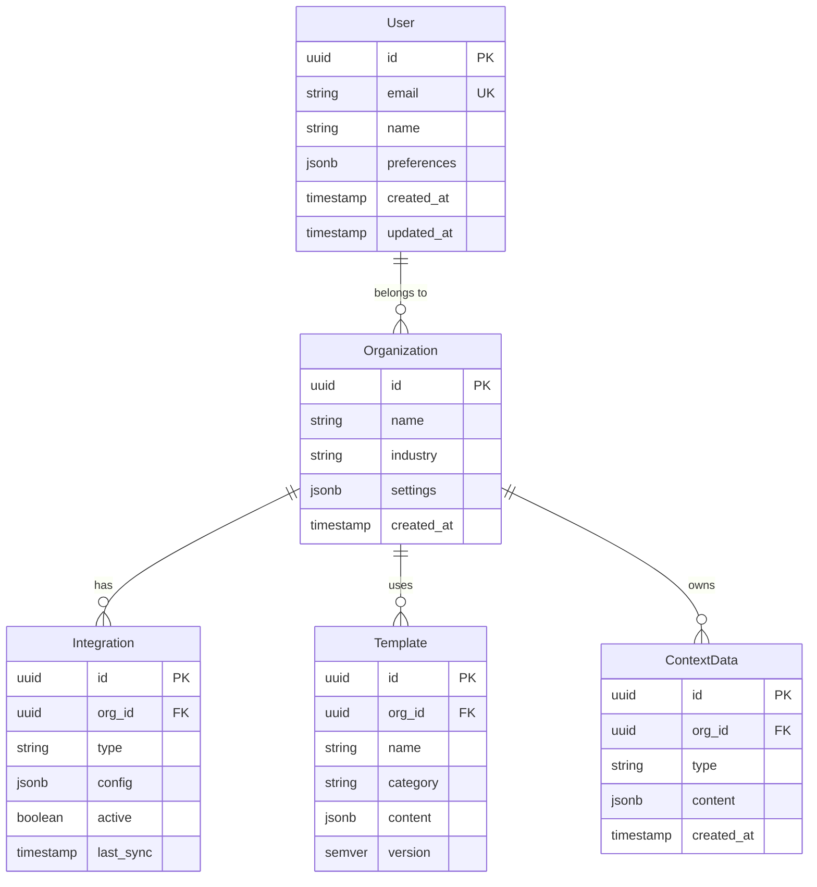
```mermaid
erDiagram
    User ||--o{ Organization : "belongs to"
    Organization ||--o{ Integration : "has"
    Organization ||--o{ Template : "uses"
    Organization ||--o{ ContextData : "owns"
    
    User {
        uuid id PK
        string email UK
        string name
        jsonb preferences
        timestamp created_at
        timestamp updated_at
    }
    
    Organization {
        uuid id PK
        string name
        string industry
        jsonb settings
        timestamp created_at
    }
    
    Integration {
        uuid id PK
        uuid org_id FK
        string type
        jsonb config
        boolean active
        timestamp last_sync
    }
    
    Template {
        uuid id PK
        uuid org_id FK
        string name
        string category
        jsonb content
        semver version
    }
    
    ContextData {
        uuid id PK
        uuid org_id FK
        string type
        jsonb content
        timestamp created_at
    }
```

### 3.2.2 Data Management Strategy

| Aspect | Strategy | Implementation |
|--------|----------|----------------|
| Migrations | Versioned migrations | - Flyway for schema changes<br>- Blue-green deployments<br>- Rollback procedures |
| Versioning | Semantic versioning | - Schema version tracking<br>- Backward compatibility<br>- Migration dependencies |
| Archival | Time-based archival | - 90-day active retention<br>- Yearly archival<br>- Compliance preservation |
| Privacy | Data protection | - Column-level encryption<br>- Data masking<br>- Access logging |

### 3.2.3 Performance Optimization

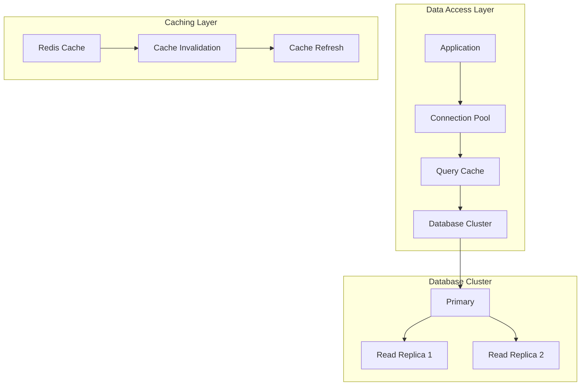
```mermaid
graph TD
    subgraph "Data Access Layer"
        A[Application] --> B[Connection Pool]
        B --> C[Query Cache]
        C --> D[Database Cluster]
    end
    
    subgraph "Database Cluster"
        D --> E[Primary]
        E --> F[Read Replica 1]
        E --> G[Read Replica 2]
    end
    
    subgraph "Caching Layer"
        H[Redis Cache] --> I[Cache Invalidation]
        I --> J[Cache Refresh]
    end
```

## 3.3 API DESIGN

### 3.3.1 API Architecture

| Component | Specification | Details |
|-----------|--------------|----------|
| Protocol | REST/GraphQL | - HTTPS only<br>- WebSocket for real-time<br>- gRPC for internal |
| Authentication | OAuth 2.0 + JWT | - Token-based auth<br>- Refresh token rotation<br>- SSO integration |
| Rate Limiting | Token bucket | - 1000 req/min per user<br>- 5000 req/min per org<br>- Burst allowance |
| Versioning | URI-based | - /api/v1/<resource><br>- Deprecation notices<br>- Version sunset policy |

### 3.3.2 API Flow Specifications

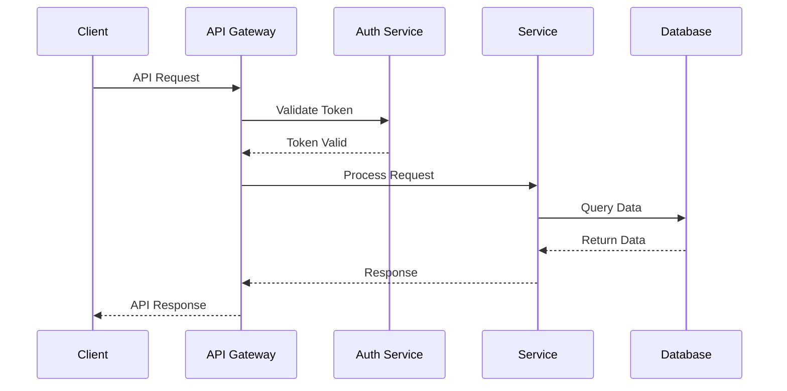
```mermaid
sequenceDiagram
    participant C as Client
    participant G as API Gateway
    participant A as Auth Service
    participant S as Service
    participant D as Database
    
    C->>G: API Request
    G->>A: Validate Token
    A-->>G: Token Valid
    G->>S: Process Request
    S->>D: Query Data
    D-->>S: Return Data
    S-->>G: Response
    G-->>C: API Response
```

### 3.3.3 Integration Patterns

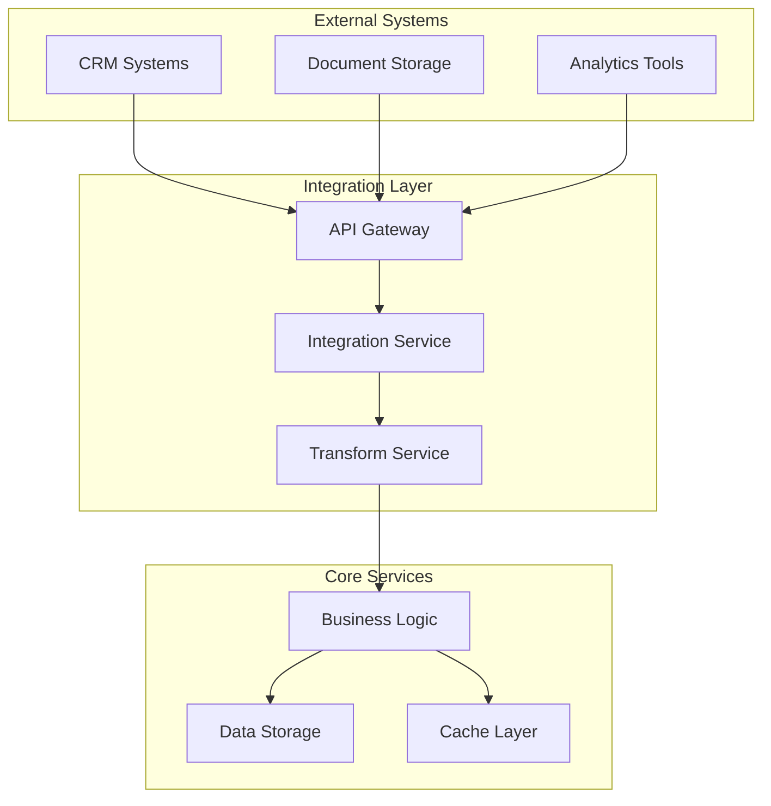
```mermaid
graph TD
    subgraph "External Systems"
        A[CRM Systems]
        B[Document Storage]
        C[Analytics Tools]
    end
    
    subgraph "Integration Layer"
        D[API Gateway]
        E[Integration Service]
        F[Transform Service]
    end
    
    subgraph "Core Services"
        G[Business Logic]
        H[Data Storage]
        I[Cache Layer]
    end
    
    A --> D
    B --> D
    C --> D
    D --> E
    E --> F
    F --> G
    G --> H
    G --> I
```

# 4. TECHNOLOGY STACK

## 4.1 PROGRAMMING LANGUAGES

| Platform/Component | Language | Version | Justification |
|-------------------|----------|---------|---------------|
| Backend Services | Python | 3.11+ | - FastAPI optimization support<br>- Strong AI/ML ecosystem<br>- Extensive integration libraries |
| Frontend Web | TypeScript | 5.0+ | - Type safety for large codebase<br>- Enhanced developer productivity<br>- React ecosystem compatibility |
| Integration Hub | Go | 1.20+ | - High performance for I/O operations<br>- Strong concurrency support<br>- Efficient resource utilization |
| Data Processing | Python | 3.11+ | - Pandas/NumPy ecosystem<br>- ML model integration<br>- Data science tooling |

## 4.2 FRAMEWORKS & LIBRARIES

### Core Frameworks

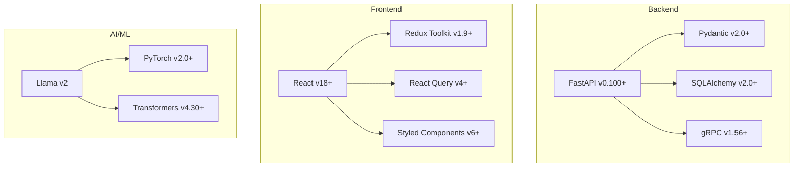
```mermaid
graph TD
    subgraph Backend
        A[FastAPI v0.100+] --> B[Pydantic v2.0+]
        A --> C[SQLAlchemy v2.0+]
        A --> D[gRPC v1.56+]
    end
    
    subgraph Frontend
        E[React v18+] --> F[Redux Toolkit v1.9+]
        E --> G[React Query v4+]
        E --> H[Styled Components v6+]
    end
    
    subgraph AI/ML
        I[Llama v2] --> J[PyTorch v2.0+]
        I --> K[Transformers v4.30+]
    end
```

### Supporting Libraries

| Category | Library | Version | Purpose |
|----------|---------|---------|----------|
| API Development | FastAPI | 0.100+ | High-performance async API framework |
| Data Validation | Pydantic | 2.0+ | Type validation and settings management |
| ORM | SQLAlchemy | 2.0+ | Database abstraction and management |
| State Management | Redux Toolkit | 1.9+ | Frontend state management |
| UI Components | MUI | 5.14+ | Material Design implementation |
| Testing | Jest/Pytest | 29+/7+ | Testing frameworks for FE/BE |

## 4.3 DATABASES & STORAGE

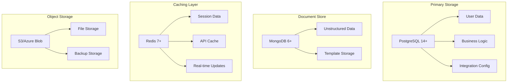
```mermaid
graph TD
    subgraph Primary Storage
        A[PostgreSQL 14+] --> B[User Data]
        A --> C[Business Logic]
        A --> D[Integration Config]
    end
    
    subgraph Document Store
        E[MongoDB 6+] --> F[Unstructured Data]
        E --> G[Template Storage]
    end
    
    subgraph Caching Layer
        H[Redis 7+] --> I[Session Data]
        H --> J[API Cache]
        H --> K[Real-time Updates]
    end
    
    subgraph Object Storage
        L[S3/Azure Blob] --> M[File Storage]
        L --> N[Backup Storage]
    end
```

### Storage Strategy Matrix

| Data Type | Storage Solution | Backup Strategy | Retention |
|-----------|-----------------|-----------------|-----------|
| Structured Data | PostgreSQL | Daily snapshots | 90 days |
| Document Data | MongoDB | Continuous backup | 30 days |
| Cache Data | Redis | None | 24 hours |
| File Storage | S3/Azure Blob | Cross-region | 7 years |

## 4.4 THIRD-PARTY SERVICES

| Service Category | Provider | Purpose | Integration Method |
|-----------------|----------|----------|-------------------|
| Authentication | Auth0 | SSO/Identity management | OAuth2/OIDC |
| Monitoring | Datadog | System monitoring | API/Agent |
| Error Tracking | Sentry | Error reporting | SDK |
| Email Service | SendGrid | Transactional emails | REST API |
| Analytics | Mixpanel | User analytics | SDK |

## 4.5 DEVELOPMENT & DEPLOYMENT

### Development Pipeline

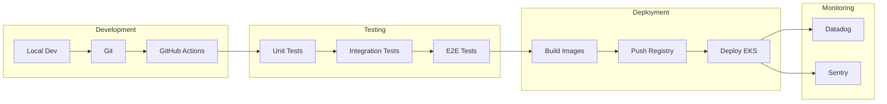
```mermaid
graph LR
    subgraph Development
        A[Local Dev] --> B[Git]
        B --> C[GitHub Actions]
    end
    
    subgraph Testing
        C --> D[Unit Tests]
        D --> E[Integration Tests]
        E --> F[E2E Tests]
    end
    
    subgraph Deployment
        F --> G[Build Images]
        G --> H[Push Registry]
        H --> I[Deploy EKS]
    end
    
    subgraph Monitoring
        I --> J[Datadog]
        I --> K[Sentry]
    end
```

### Infrastructure Requirements

| Component | Tool | Version | Configuration |
|-----------|------|---------|---------------|
| Container Runtime | Docker | 24+ | Buildkit enabled |
| Orchestration | Kubernetes | 1.25+ | EKS/AKS managed |
| Service Mesh | Istio | 1.18+ | mTLS enabled |
| IaC | Terraform | 1.5+ | State in S3/Azure |
| CI/CD | GitHub Actions | N/A | Self-hosted runners |

# 5. SYSTEM DESIGN

## 5.1 USER INTERFACE DESIGN

### 5.1.1 Core Interface Components

| Component | Description | Key Features |
|-----------|-------------|--------------|
| Chat Interface | Primary interaction method | - Persistent chat window<br>- Context-aware suggestions<br>- Rich text formatting<br>- File attachments |
| Command Bar | Quick access to functions | - Global search<br>- Command palette<br>- Keyboard shortcuts<br>- Recent actions |
| Dashboard | Business insights view | - Customizable widgets<br>- Real-time updates<br>- Data visualizations |
| Template Library | Pre-built configurations | - Category browsing<br>- Search functionality<br>- One-click deployment |

### 5.1.2 Layout Structure

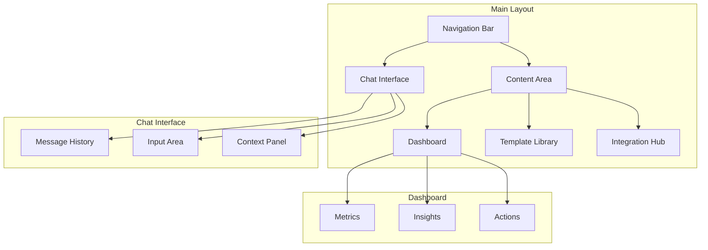
```mermaid
graph TD
    subgraph "Main Layout"
        A[Navigation Bar] --> B[Content Area]
        A --> C[Chat Interface]
        B --> D[Dashboard]
        B --> E[Template Library]
        B --> F[Integration Hub]
    end
    
    subgraph "Chat Interface"
        C --> G[Message History]
        C --> H[Input Area]
        C --> I[Context Panel]
    end
    
    subgraph "Dashboard"
        D --> J[Metrics]
        D --> K[Insights]
        D --> L[Actions]
    end
```

### 5.1.3 User Flow Patterns

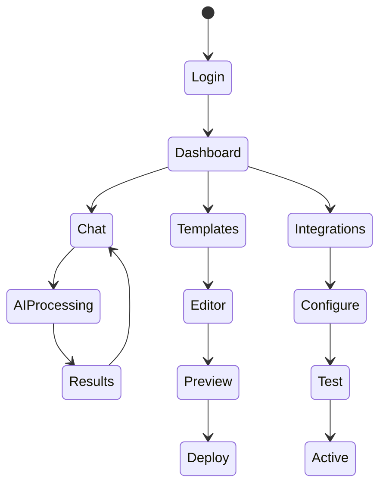
```mermaid
stateDiagram-v2
    [*] --> Login
    Login --> Dashboard
    Dashboard --> Chat
    Dashboard --> Templates
    Dashboard --> Integrations
    
    Chat --> AIProcessing
    AIProcessing --> Results
    Results --> Chat
    
    Templates --> Editor
    Editor --> Preview
    Preview --> Deploy
    
    Integrations --> Configure
    Configure --> Test
    Test --> Active
```

## 5.2 DATABASE DESIGN

### 5.2.1 Schema Design

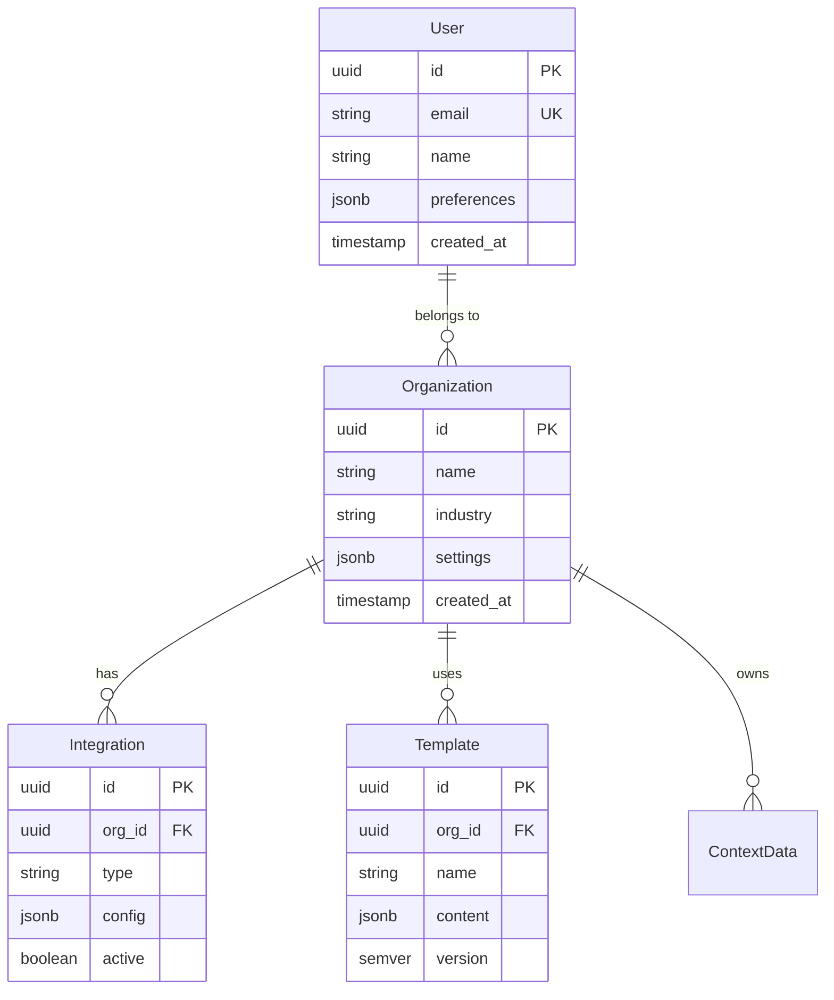
```mermaid
erDiagram
    User ||--o{ Organization : "belongs to"
    Organization ||--o{ Integration : "has"
    Organization ||--o{ Template : "uses"
    Organization ||--o{ ContextData : "owns"
    
    User {
        uuid id PK
        string email UK
        string name
        jsonb preferences
        timestamp created_at
    }
    
    Organization {
        uuid id PK
        string name
        string industry
        jsonb settings
        timestamp created_at
    }
    
    Integration {
        uuid id PK
        uuid org_id FK
        string type
        jsonb config
        boolean active
    }
    
    Template {
        uuid id PK
        uuid org_id FK
        string name
        jsonb content
        semver version
    }
```

### 5.2.2 Data Storage Strategy

| Data Type | Storage Solution | Backup Strategy | Retention |
|-----------|-----------------|-----------------|-----------|
| User Data | PostgreSQL | Daily snapshots | 90 days |
| Analytics | TimescaleDB | Weekly backups | 12 months |
| Documents | MongoDB | Continuous backup | 30 days |
| Cache | Redis | None | 24 hours |
| Files | S3/Azure Blob | Cross-region | 7 years |

## 5.3 API DESIGN

### 5.3.1 API Architecture

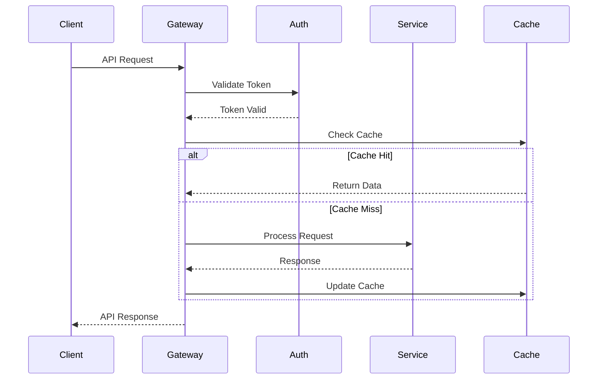
```mermaid
sequenceDiagram
    participant Client
    participant Gateway
    participant Auth
    participant Service
    participant Cache
    
    Client->>Gateway: API Request
    Gateway->>Auth: Validate Token
    Auth-->>Gateway: Token Valid
    Gateway->>Cache: Check Cache
    alt Cache Hit
        Cache-->>Gateway: Return Data
    else Cache Miss
        Gateway->>Service: Process Request
        Service-->>Gateway: Response
        Gateway->>Cache: Update Cache
    end
    Gateway-->>Client: API Response
```

### 5.3.2 API Endpoints

| Endpoint | Method | Purpose | Authentication |
|----------|---------|---------|----------------|
| /api/v1/auth | POST | Authentication | Public |
| /api/v1/organizations | GET/POST | Org management | JWT |
| /api/v1/templates | GET/POST | Template operations | JWT |
| /api/v1/integrations | GET/POST | Integration management | JWT |
| /api/v1/context | POST | AI processing | JWT |

### 5.3.3 Integration Patterns


```mermaid
graph TD
    subgraph "External Systems"
        A[CRM Systems]
        B[Document Storage]
        C[Analytics Tools]
    end
    
    subgraph "Integration Layer"
        D[API Gateway]
        E[Integration Service]
        F[Transform Service]
    end
    
    subgraph "Core Services"
        G[Business Logic]
        H[Data Storage]
        I[Cache Layer]
    end
    
    A --> D
    B --> D
    C --> D
    D --> E
    E --> F
    F --> G
    G --> H
    G --> I
```

# 6. USER INTERFACE DESIGN

## 6.1 Design System

| Element | Style | Implementation |
|---------|--------|----------------|
| Typography | System fonts | -Primary: SF Pro/Segoe UI/Roboto<br>-Headings: 24/20/16px<br>-Body: 14px<br>-Monospace: 12px |
| Colors | MacOS-inspired | -Primary: #007AFF<br>-Secondary: #5856D6<br>-Background: #FFFFFF/#000000<br>-Text: #000000/#FFFFFF |
| Spacing | 8px grid | -Base unit: 8px<br>-Components: 16px<br>-Sections: 24px<br>-Pages: 32px |
| Shadows | Layered depth | -Surface: 0 2px 4px rgba(0,0,0,0.1)<br>-Modal: 0 4px 8px rgba(0,0,0,0.2)<br>-Popup: 0 8px 16px rgba(0,0,0,0.3) |

## 6.2 Core Layouts

### 6.2.1 Main Dashboard
```
+----------------------------------------------------------+
|  [=] COREos                                    [@] [?] [!] |
+------------------+-----------------------------------+-----+
|                  |                                   |     |
| [#] Dashboard    | +-------------------------------+ |     |
| [*] Favorites    | |        Quick Actions          | |  C  |
| [+] Templates    | | [+]New [^]Import [$]Billing   | |  H  |
|                  | +-------------------------------+ |  A  |
| INTEGRATIONS     |                                   |  T  |
| +- CRM          | +-------------------------------+ |     |
| +- Documents    | |        Business Metrics       | |  I  |
| +- Analytics    | | [====] Tasks Complete         | |  N  |
|                  | | [====] Integration Health    | |  T  |
| WORKSPACE        | | [====] AI Model Status       | |  E  |
| +- Projects     | +-------------------------------+ |  R  |
| +- Teams        |                                   |  F  |
| +- Settings     | +-------------------------------+ |  A  |
|                  | |        Recent Activity       | |  C  |
|                  | | > Template updated           | |  E  |
|                  | | > Integration synced         | |     |
|                  | | > Analysis completed         | |     |
+------------------+-----------------------------------+-----+
```

### 6.2.2 Chat Interface
```
+----------------------------------------------------------+
|                     Context Panel                          |
| [i] Current Project: Sales Analysis                        |
| [i] Active Template: Growth Strategy                       |
+----------------------------------------------------------+
|                                                           |
|  AI: How can I help with your sales analysis today?       |
|                                                           |
|  User: Show me last month's performance                   |
|                                                           |
|  AI: Here's the analysis:                                 |
|  +------------------------------------------------+      |
|  |  Revenue: $125,000 [+15% vs prev month]         |      |
|  |  Customers: 250 [+5% vs prev month]             |      |
|  |  Avg Deal Size: $500 [-2% vs prev month]        |      |
|  +------------------------------------------------+      |
|                                                           |
+----------------------------------------------------------+
| [...........................................................] |
| [^]Files [+]Template [@]Mention [!]Priority [Send]         |
+----------------------------------------------------------+
```

### 6.2.3 Template Library
```
+----------------------------------------------------------+
| Templates                                    [+] Add New   |
+----------------------------------------------------------+
| Search: [...............................] [v] Category     |
+----------------------------------------------------------+
| RECOMMENDED                                                |
| +------------------------------------------------+       |
| | [*] Sales Pipeline                              |       |
| | [i] Automated customer journey workflow         |       |
| | [Button] Use Template    [Button] Preview       |       |
| +------------------------------------------------+       |
|                                                           |
| RECENTLY USED                                             |
| +------------------------------------------------+       |
| | [*] Marketing Campaign                          |       |
| | [i] Multi-channel campaign orchestration        |       |
| | [Button] Use Template    [Button] Preview       |       |
| +------------------------------------------------+       |
+----------------------------------------------------------+
```

## 6.3 Component Library

### 6.3.1 Navigation Elements
```
Primary Navigation:
[#] Dashboard     Active state with highlight
[=] Menu          Collapsed state
[>] Submenu       Expandable section

Secondary Navigation:
[<] Back          Previous view
[^] Up Level      Parent section
[v] Down          Expand options
```

### 6.3.2 Interactive Elements
```
Buttons:
[Primary Action]   Filled background
[Secondary]        Outlined style
[Tertiary]         Text only

Form Controls:
[ ] Checkbox       Unchecked state
[x] Checkbox       Checked state
( ) Radio          Unselected
(•) Radio          Selected
[v] Dropdown       Collapsed
[....] Input       Text entry
[====] Progress    Status indicator
```

### 6.3.3 Status Indicators
```
[!] Error         Red background
[i] Info          Blue background
[✓] Success       Green background
[*] Warning       Yellow background

Loading States:
[====]            Progress bar
[•••]             Loading dots
[↻]               Refresh/Retry
```

## 6.4 Responsive Breakpoints

| Breakpoint | Layout Changes |
|------------|----------------|
| Desktop (>1200px) | Full 3-column layout with chat interface |
| Tablet (768-1199px) | 2-column layout, collapsible navigation |
| Mobile (<767px) | Single column, bottom navigation bar |

## 6.5 Interaction Patterns

| Pattern | Implementation |
|---------|----------------|
| Drag & Drop | Template customization, widget arrangement |
| Infinite Scroll | Chat history, activity logs |
| Progressive Disclosure | Template configuration steps |
| Contextual Help | Inline documentation, tooltips |
| Real-time Updates | Status indicators, notifications |

# 7. SECURITY CONSIDERATIONS

## 7.1 AUTHENTICATION AND AUTHORIZATION

### Authentication Methods

| Method | Implementation | Use Case |
|--------|----------------|-----------|
| OAuth 2.0/OIDC | Auth0 integration | SSO providers (Google, Microsoft, Apple) |
| JWT | Custom tokens | API authentication |
| MFA | TOTP/SMS | Additional security layer |
| API Keys | Secure key storage | Integration authentication |

### Authorization Model

```mermaid
graph TD
    A[User Request] --> B{Authentication}
    B -->|Valid| C{Authorization}
    B -->|Invalid| D[401 Unauthorized]
    
    C -->|Permitted| E[Access Granted]
    C -->|Denied| F[403 Forbidden]
    
    subgraph "RBAC System"
        G[Super Admin]
        H[Organization Admin]
        I[Standard User]
        J[Integration User]
        
        G -->|Can Manage| H
        H -->|Can Manage| I
        H -->|Can Configure| J
    end
```

### Permission Matrix

| Role | Data Access | Template Access | Integration Config | User Management |
|------|-------------|-----------------|-------------------|-----------------|
| Super Admin | Full | Full | Full | Full |
| Org Admin | Org Only | Full | Full | Org Only |
| Standard User | Limited | Read/Use | Read Only | None |
| Integration User | API Scope | None | None | None |

## 7.2 DATA SECURITY

### Encryption Standards

| Layer | Method | Key Management |
|-------|---------|----------------|
| Data at Rest | AES-256-GCM | AWS KMS/Azure Key Vault |
| Data in Transit | TLS 1.3 | Automated cert rotation |
| Database | Column-level encryption | Secure key storage |
| File Storage | Client-side encryption | Per-org encryption keys |

### Data Classification

```mermaid
graph TD
    subgraph "Data Classification"
        A[Input Data] --> B{Classification}
        B -->|Sensitive| C[Encrypted Storage]
        B -->|Confidential| D[Restricted Access]
        B -->|Public| E[Standard Storage]
        
        C --> F[Audit Logging]
        D --> F
        E --> F
    end
```

### Data Protection Measures

| Category | Implementation | Monitoring |
|----------|----------------|------------|
| PII Data | Automatic detection and masking | Real-time alerts |
| Business Data | Role-based access control | Access logging |
| Integration Data | Encrypted credentials | Usage monitoring |
| Audit Logs | Immutable storage | Retention tracking |

## 7.3 SECURITY PROTOCOLS

### Network Security

```mermaid
graph TD
    subgraph "Security Layers"
        A[WAF] --> B[Load Balancer]
        B --> C[API Gateway]
        C --> D[Service Mesh]
        D --> E[Application]
        
        F[DDoS Protection] --> A
        G[IDS/IPS] --> B
        H[Network Policies] --> D
    end
```

### Security Standards Compliance

| Standard | Implementation | Validation |
|----------|----------------|------------|
| SOC 2 Type II | Security controls and monitoring | Annual audit |
| GDPR | Data protection measures | Regular assessment |
| ISO 27001 | Information security management | Certification |
| OWASP Top 10 | Security best practices | Automated testing |

### Security Monitoring

| Component | Tool | Alert Threshold |
|-----------|------|-----------------|
| Access Logs | Datadog | Suspicious patterns |
| API Usage | Custom metrics | Rate limit breaches |
| Authentication | Auth0 logs | Failed attempts |
| Infrastructure | AWS GuardDuty/Azure Security Center | Security threats |

### Incident Response

```mermaid
graph LR
    A[Detection] --> B[Assessment]
    B --> C[Containment]
    C --> D[Eradication]
    D --> E[Recovery]
    E --> F[Lessons Learned]
    
    B -->|Critical| G[Emergency Response]
    G --> C
```

### Security Update Process

| Type | Frequency | Implementation |
|------|-----------|----------------|
| Security Patches | Weekly | Automated deployment |
| Dependency Updates | Monthly | Automated scanning |
| Certificate Rotation | 90 days | Automated renewal |
| Security Audit | Quarterly | Manual review |

# 8. INFRASTRUCTURE

## 8.1 DEPLOYMENT ENVIRONMENT

| Environment | Configuration | Purpose |
|-------------|--------------|----------|
| Development | Single-region AWS/Azure | Feature development and testing |
| Staging | Multi-region AWS/Azure | Pre-production validation |
| Production | Multi-region, Multi-cloud | Production workloads |

### Environment Architecture

```mermaid
graph TD
    subgraph "Production Environment"
        A[Route 53/Azure Front Door] --> B[CloudFront/Azure CDN]
        B --> C[ALB/Application Gateway]
        C --> D[EKS/AKS Cluster]
        D --> E[RDS/Azure DB]
        D --> F[ElastiCache/Azure Cache]
        
        G[Disaster Recovery Region]
        C -.-> G
        E -.-> G
        F -.-> G
    end
    
    subgraph "Staging Environment"
        H[Reduced Scale Production Clone]
    end
    
    subgraph "Development Environment"
        I[Local Development]
        J[Development Cluster]
    end
```

## 8.2 CLOUD SERVICES

| Service Type | AWS | Azure | Purpose |
|-------------|-----|-------|----------|
| Compute | EKS | AKS | Container orchestration |
| Database | RDS PostgreSQL | Azure Database | Primary data storage |
| Cache | ElastiCache | Azure Cache | Performance optimization |
| Storage | S3 | Blob Storage | Object storage |
| CDN | CloudFront | Azure CDN | Content delivery |
| DNS | Route 53 | Azure DNS | DNS management |
| Monitoring | CloudWatch | Azure Monitor | System monitoring |
| Security | KMS | Key Vault | Key management |

## 8.3 CONTAINERIZATION

### Container Strategy

```mermaid
graph TD
    subgraph "Container Architecture"
        A[Base Images] --> B[Service Images]
        B --> C[Development Images]
        B --> D[Production Images]
        
        E[Image Registry] --> F[Development Cluster]
        E --> G[Production Cluster]
        
        H[CI Pipeline] --> E
    end
```

| Component | Technology | Version | Configuration |
|-----------|------------|---------|---------------|
| Container Runtime | containerd | 1.6+ | Production-optimized |
| Base Image | Alpine | 3.18+ | Minimal footprint |
| Registry | ECR/ACR | Latest | Private, replicated |
| Build Tool | Docker BuildKit | Latest | Multi-stage builds |
| Security Scanner | Trivy | Latest | Image scanning |

## 8.4 ORCHESTRATION

### Kubernetes Configuration

```mermaid
graph TD
    subgraph "Kubernetes Architecture"
        A[Ingress Controller] --> B[Service Mesh]
        B --> C[Application Pods]
        C --> D[Persistent Storage]
        
        E[Config Management] --> C
        F[Secrets Management] --> C
        G[Auto Scaling] --> C
    end
```

| Component | Implementation | Purpose |
|-----------|---------------|----------|
| Service Mesh | Istio 1.18+ | Traffic management |
| Ingress | NGINX Ingress | Load balancing |
| Config Management | ConfigMaps | Application configuration |
| Secrets | External Secrets | Sensitive data management |
| Storage | CSI Drivers | Persistent storage |
| Monitoring | Prometheus/Grafana | Metrics and visualization |

## 8.5 CI/CD PIPELINE

### Pipeline Architecture

```mermaid
graph LR
    subgraph "CI Pipeline"
        A[Code Push] --> B[Build]
        B --> C[Test]
        C --> D[Security Scan]
        D --> E[Image Build]
    end
    
    subgraph "CD Pipeline"
        E --> F[Dev Deploy]
        F --> G[Stage Deploy]
        G --> H[Prod Deploy]
    end
    
    subgraph "Quality Gates"
        I[Unit Tests]
        J[Integration Tests]
        K[Security Checks]
        L[Performance Tests]
    end
```

| Stage | Tools | Actions |
|-------|-------|---------|
| Source Control | GitHub | Code versioning, PR reviews |
| CI | GitHub Actions | Build, test, scan |
| Artifact Management | ECR/ACR | Image storage |
| Deployment | ArgoCD | GitOps deployments |
| Testing | Jest/Pytest | Automated testing |
| Security | SonarQube, Trivy | Code and image scanning |
| Monitoring | Datadog | Pipeline monitoring |

### Deployment Strategy

| Environment | Strategy | Rollback |
|-------------|----------|----------|
| Development | Direct deployment | Manual revert |
| Staging | Blue/Green | Automated rollback |
| Production | Canary | Automated rollback |

# 8. APPENDICES

## 8.1 ADDITIONAL TECHNICAL INFORMATION

### Development Environment Setup

```mermaid
graph TD
    A[Local Development] --> B[Docker Desktop]
    B --> C[Local Kubernetes]
    B --> D[Development Database]
    
    E[VS Code] --> F[Extensions]
    F --> G[Python Tools]
    F --> H[TypeScript Tools]
    F --> I[Docker Tools]
    
    J[Git] --> K[GitHub]
    K --> L[Actions Runner]
    L --> M[CI Pipeline]
```

### Error Code Reference

| Code Range | Category | Description |
|------------|----------|-------------|
| 1000-1999 | Authentication | User authentication and authorization errors |
| 2000-2999 | Integration | External service connection issues |
| 3000-3999 | Data Processing | Data validation and transformation errors |
| 4000-4999 | AI Operations | Model inference and processing errors |
| 5000-5999 | System | Infrastructure and platform errors |

### Performance Benchmarks

| Operation | Target Latency | Max Load | Degradation Point |
|-----------|---------------|-----------|-------------------|
| Chat Response | <500ms | 1000 req/s | 2000 req/s |
| Data Sync | <2s | 100 sync/s | 200 sync/s |
| AI Inference | <3s | 50 req/s | 100 req/s |
| Template Deploy | <5s | 20 deploy/s | 40 deploy/s |

## 8.2 GLOSSARY

| Term | Definition |
|------|------------|
| Contextual Engine | AI-powered system that analyzes business context and generates insights |
| Data Platform | Unified system for managing and processing business data |
| Integration Hub | Central system for managing external tool connections |
| Llama Model | Open-source AI model used for natural language processing |
| Template System | Pre-configured business process and workflow templates |
| Network Effect | Value increase as more users contribute data and interactions |
| Business Canvas | Structured framework for business model analysis |
| Command Palette | Quick-access interface for system functions |
| Dark Mode | Alternative color scheme for low-light environments |
| GitOps | Infrastructure and deployment management using Git |

## 8.3 ACRONYMS

| Acronym | Full Form |
|---------|-----------|
| ABAC | Attribute-Based Access Control |
| API | Application Programming Interface |
| CDN | Content Delivery Network |
| CSP | Cloud Service Provider |
| DNS | Domain Name System |
| ETL | Extract, Transform, Load |
| GDPR | General Data Protection Regulation |
| IaC | Infrastructure as Code |
| JWT | JSON Web Token |
| K8s | Kubernetes |
| MFA | Multi-Factor Authentication |
| NLP | Natural Language Processing |
| OIDC | OpenID Connect |
| PII | Personally Identifiable Information |
| RBAC | Role-Based Access Control |
| REST | Representational State Transfer |
| SaaS | Software as a Service |
| SDK | Software Development Kit |
| SLO | Service Level Objective |
| SSO | Single Sign-On |
| TLS | Transport Layer Security |
| UI/UX | User Interface/User Experience |
| VPC | Virtual Private Cloud |
| WSS | WebSocket Secure |
| YAML | YAML Ain't Markup Language |

## 8.4 REFERENCE ARCHITECTURE

```mermaid
graph TD
    subgraph "Frontend Layer"
        A[Web Application]
        B[Mobile Interface]
    end
    
    subgraph "API Layer"
        C[API Gateway]
        D[Authentication]
        E[Rate Limiting]
    end
    
    subgraph "Service Layer"
        F[Contextual Engine]
        G[Data Platform]
        H[Integration Hub]
    end
    
    subgraph "Data Layer"
        I[(PostgreSQL)]
        J[(MongoDB)]
        K[(Redis)]
    end
    
    subgraph "Infrastructure Layer"
        L[Kubernetes]
        M[Service Mesh]
        N[Monitoring]
    end
    
    A --> C
    B --> C
    C --> D
    C --> E
    D --> F
    D --> G
    D --> H
    F --> I
    G --> I
    G --> J
    H --> K
```